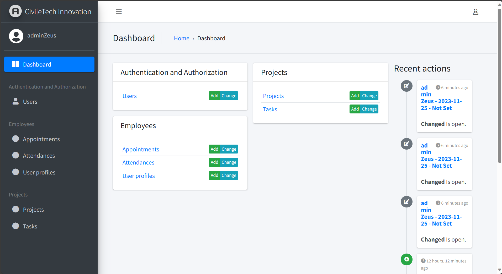
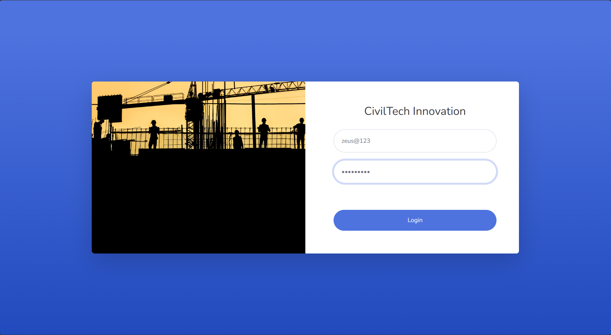
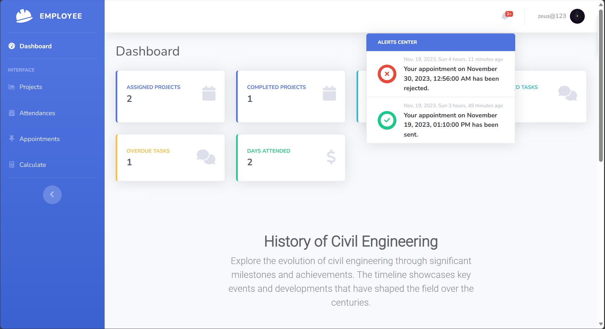
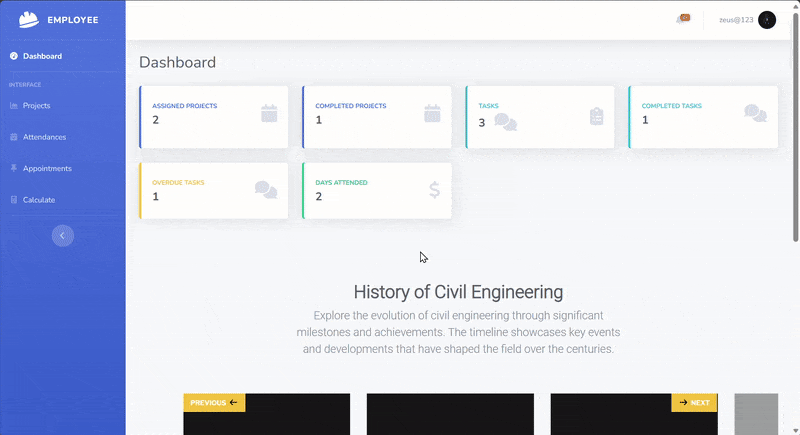

# Employee Management System - 2023

## Introduction 

Hello and welcome to our Employee Management System! This is a basic yet powerful tool that handles attendance, appointments, user profiles, and project/task management. It's simple, functional, and here to make your work life easier. Let's dive in and get things done! 👌

## Installation

1. Clone the repository:

    ```bash
    git clone https://github.com/SaucedCODER/djangoEmployeeManagementProject.git
    ```

2. Navigate to the project directory:

    ```bash
    cd djangoEmployeeManagementProject
    ```
## Virtual Environment

It's recommended to use a virtual environment for your project. Follow these steps to set up and activate the virtual environment:

### Create a virtual environment:

```bash
python -m venv venv
```
### Activate the Virtual Environment:

On Windows:

```bash
.\venv\Scripts\activate
```
On Linux/Bash:

```bash
source venv/bin/activate
```

3. Install dependencies:

    ```bash
    pip install -r requirements.txt
    ```

4. Set up MySQL database in XAMPP and update database configurations in `settings.py`.
 ## Database Configuration

In `settings.py`, update the `DATABASES` section with your MySQL configuration:

```python
DATABASES = {
    'default': {
        'ENGINE': 'django.db.backends.mysql',
        'NAME': 'your_database_name',
        'USER': 'your_database_user',
        'PASSWORD': 'your_database_password',
        'HOST': 'localhost',
        'PORT': '3306',
    }
}

```

5. Apply database migrations:

    ```bash
    python manage.py migrate
    ```

6. Run the development server:

    ```bash
    python manage.py runserver 8080
    ```

7. Access the application at [http://localhost:8080](http://localhost:8080).

## Features

### 1. Attendance Tracking System

- Users can mark open attendances created by administrators.
- Streamlined attendance management for easy tracking.

### 2. Appointment System

- Schedule appointments with a notification system (non-realtime).
- Users receive timely notifications for their scheduled appointments.

### 3. User Profile Management

- Users can edit their basic information.
- Change password functionality for enhanced security.

### 4. Project and Task Management

- Efficiently manage projects and tasks associated with them.
- Built-in CRUD functionality for easy project and task administration.

### 5. Admin Panel

- Utilizes Django for a robust admin panel.
- Jazzmin template for a modern and user-friendly admin interface.
- Good safeguard measures in place for the assignment of projects and tasks.



*Caption: The modern and user-friendly admin panel powered by Django and Jazzmin.*

### Screenshots

#### Login Screen



*Caption: The login screen for users to access the system.*

#### User Panel



*Caption: The user panel displaying key functionalities for individual users.*

### History of Civil Engineering in User Dashboard



*Caption: Explore the history of civil engineering in the user dashboard through this GIF.*

## Contributing

If you'd like to contribute to the project, please follow the [contribution guidelines](CONTRIBUTING.md).

## Acknowledgments

- Special thanks to [Django](https://www.djangoproject.com/) for providing a powerful web framework.
- The [Jazzmin](https://github.com/farridav/django-jazzmin) template for enhancing the admin interface.

Feel free to explore and enhance the system as needed for your specific use case. If you encounter any issues or have suggestions, don't hesitate to contribute or reach out for support. Happy coding!

---

## About the Author


<p align="center">
  
</p>
<p align="center">
  <strong>SaucedCODER</strong>
</p>


**Zeus**

- GitHub: [SaucedCODER](https://github.com/SaucedCODER)
- LinkedIn: [Zeus O.](https://www.linkedin.com/in/zeus-miguel-orilla-958711264/)

---

## License and Copyright

- This project is licensed under the [MIT License](LICENSE).
- © 2023 Zeus Miguel O.
